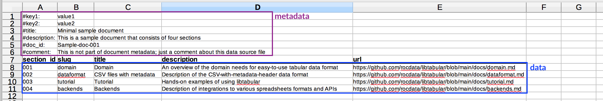

# libtabular
A general purpose library for reading and writing tabular data (CSV, TSV, gsheets, ods, xlsx).


## Pitch
Imagine a `csv.DictReader`-like API you can use to "open" and "read" any source
of tabular data (CSV, TSV, gsheets, ods, xlsx) without having to worry about a
million libraries and authentication APIs.

## Tabular data with metadata headers
The main "new feature" that `libtabular` provides is a way to parse "metadata headers"
in tabular data (e.g. CSV) automatically. These "CSV metadata headers" are directly
analogous to the YAML headers that sometimes appear in Markdown files used in
static site generators.


## Example




Using `libtabular`, you could "extract" the data and metadata from this source
file using a few commands:

```python
>>> from libtabular import fromcsvwithheader

>>> table = fromcsvwithheader('samples/minimal.csv')

>>> table.metadata
{'key1': 'value1',
 'key2': 'value2',
 'title': 'Minimal sample document',
 'description': 'This is a sample document that consists of four sections',
 'doc_id': 'Sample-doc-001',
 'comment': 'This is not part of document metadata; just a comment...'}

>>> list(table.dicts())
[{'section_id': '002',
  'slug': 'dataformat',
  'title': 'CSV files with metadata',
  'description': 'Description of the CSV-with-metadata-header data format',
  'url': 'https://github.com/rocdata/libtabular/blob/main/docs/dataformat.md'},
 {'section_id': '003',
  'slug': 'tutorial',
  'title': 'Tutorial',
  'description': 'Hands-on examples of using libtabular',
  'url': 'https://github.com/rocdata/libtabular/blob/main/docs/tutorial.md'},
 {'section_id': '004',
  'slug': 'backends',
  'title': 'Backends',
  'description': 'Description of integrations to various spreadsheets formats and APIs  ',
  'url': 'https://github.com/rocdata/libtabular/blob/main/docs/backends.md'}]


>>> table.header
('section_id', 'slug', 'title', 'description', 'url')
```


## Why is this needed?

Recent work on a repository of curriculum documents, see [rocdata.global](https://rocdata.global),
requires an easy-to-use process for import and export of curriculum data like:

- Curriculum standards documents (excel sheets that specify what students should be learning)
- Content collections data (excel sheets that consists of links to useful learning resources)
- Content correlations data (excel sheets that contain "links" between curriculum standards
  and relevant learning resources)

The spreadsheet/CSV format is a natural choice for teachers and administrators,
who have experience working with this file type, so it is worth developing tools
that facilitate reading and writing tabular data:

- Curriculum bodies and ministries of education can publish curriculum standards
  documents information in machine-readable formats (instead of publishing PDFs, publish spreadsheets).
- Teachers can download standards data in easy-to-use spreadsheet formats
  (use standards for your grade level to plan your lessons).
- Curriculum experts and teachers can download blank templates with appropriate
  headers to fill in when need to specify standards documents or content correlations.


Related projects
----------------

- [`csv`](https://github.com/python/cpython/blob/master/Lib/csv.py) in stdlib
- [`pandas.read_csv`](https://pandas.pydata.org/pandas-docs/stable/reference/api/pandas.read_csv.html)
  which is a few more bells and whistles.
- [`petl`](https://petl.readthedocs.io) has a lot of functionality for loading
  CSV, TSV, Excel, and a bunch of other format. The `petl` library also supports
  convenient [transformation of columns](https://petl.readthedocs.io/en/stable/transform.html#converting-values).
  There is even a [PR](https://github.com/petl-developers/petl/pull/405/files)
  for integration with google sheets (not merged).
- [`pyexcel`](https://github.com/pyexcel/pyexcel) is a general-purpose backend
  for all kinds of spreadsheet formats (csv, xlsx, ods, etc.)
- For other spreadsheet Python libs, see [http://www.python-excel.org/](http://www.python-excel.org/)


TODOs
-----

- Add setup.py and release on PyPI
- Add `fromxlsxwithheader` for parsing Excel files
- Add `fromodswithheader` based on `pyexcel`
- Add minimal tests to check all source formats result in same data
- Add `prependheader(metadata, header, data)` function to export in this format,
  ideally generic workflow that works for any output format (csv,ods,xlsx).


Roadmap
-------

- Add tree-parsing logic utils? (libtree ;)
- Includes statements (include another .CSV file as a node in current location)
- Optional enhancements for templates: add formatting of header etc. (only for Excel and ODS)
